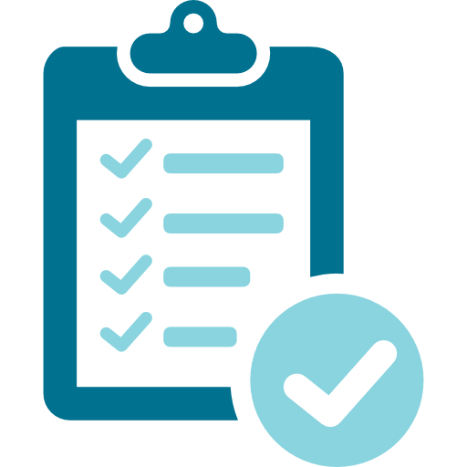

<<<<<<< HEAD
# [Start Bootstrap - Agency](https://startbootstrap.com/template-overviews/agency/)

[Agency](https://startbootstrap.com/template-overviews/agency/) is a one page agency portfolio theme for [Bootstrap](http://getbootstrap.com/) created by [Start Bootstrap](http://startbootstrap.com/). This theme features several content sections, a responsive portfolio grid with hover effects, full page portfolio item modals, a responsive timeline, and a working PHP contact form.

## Preview

**[View Live Preview](https://blackrockdigital.github.io/startbootstrap-agency/)**

## Status

## Download and Installation

To begin using this template, choose one of the following options to get started:
* [Download the latest release on Start Bootstrap](https://startbootstrap.com/template-overviews/agency/)
* Install via npm: `npm i startbootstrap-agency`
* Clone the repo: `git clone https://github.com/BlackrockDigital/startbootstrap-agency.git`
* [Fork, Clone, or Download on GitHub](https://github.com/BlackrockDigital/startbootstrap-agency)

## Usage

### Basic Usage

After downloading, simply edit the HTML and CSS files included with the template in your favorite text editor to make changes. These are the only files you need to worry about, you can ignore everything else! To preview the changes you make to the code, you can open the `index.html` file in your web browser.

### Advanced Usage

After installation, run `npm install` and then run `npm start` which will open up a preview of the template in your default browser, watch for changes to core template files, and live reload the browser when changes are saved. You can view the `gulpfile.js` to see which tasks are included with the dev environment.

#### Gulp Tasks

- `gulp` the default task that builds everything
- `gulp watch` browserSync opens the project in your default browser and live reloads when changes are made
- `gulp css` compiles SCSS files into CSS and minifies the compiled CSS
- `gulp js` minifies the themes JS file
- `gulp vendor` copies dependencies from node_modules to the vendor directory

You must have npm installed globally in order to use this build environment.

## Bugs and Issues

Have a bug or an issue with this template? [Open a new issue](https://github.com/BlackrockDigital/startbootstrap-agency/issues) here on GitHub or leave a comment on the [template overview page at Start Bootstrap](http://startbootstrap.com/template-overviews/agency/).

## About

Start Bootstrap is an open source library of free Bootstrap templates and themes. All of the free templates and themes on Start Bootstrap are released under the MIT license, which means you can use them for any purpose, even for commercial projects.

* https://startbootstrap.com
* https://twitter.com/SBootstrap

Start Bootstrap was created by and is maintained by **[David Miller](http://davidmiller.io/)**, Owner of [Blackrock Digital](http://blackrockdigital.io/).

* http://davidmiller.io
* https://twitter.com/davidmillerskt
* https://github.com/davidtmiller

Start Bootstrap is based on the [Bootstrap](http://getbootstrap.com/) framework created by [Mark Otto](https://twitter.com/mdo) and [Jacob Thorton](https://twitter.com/fat).

## Copyright and License

Copyright 2013-2019 Blackrock Digital LLC. Code released under the [MIT](https://github.com/BlackrockDigital/startbootstrap-agency/blob/gh-pages/LICENSE) license.
=======
<!DOCTYPE html>
<html lang="en">

<head>

  <meta charset="utf-8">
  <meta name="viewport" content="width=device-width, initial-scale=1, shrink-to-fit=no">
  <meta name="description" content="">
  <meta name="author" content="">

  <title>My Website</title>

  <!-- Bootstrap core CSS -->
  <link href="vendor/bootstrap/css/bootstrap.min.css" rel="stylesheet">

  <!-- Custom fonts for this template -->
  <link href="vendor/fontawesome-free/css/all.min.css" rel="stylesheet" type="text/css">
  <link href="https://fonts.googleapis.com/css?family=Montserrat:400,700" rel="stylesheet" type="text/css">
  <link href='https://fonts.googleapis.com/css?family=Kaushan+Script' rel='stylesheet' type='text/css'>
  <link href='https://fonts.googleapis.com/css?family=Droid+Serif:400,700,400italic,700italic' rel='stylesheet' type='text/css'>
  <link href='https://fonts.googleapis.com/css?family=Roboto+Slab:400,100,300,700' rel='stylesheet' type='text/css'>

  <!-- Custom styles for this template -->
  <link href="css/agency.min.css" rel="stylesheet">

</head>

<body id="page-top">

  <!-- Navigation -->
  <nav class="navbar navbar-expand-lg navbar-dark fixed-top" id="mainNav">
    

      <a class="navbar-brand js-scroll-trigger" href="#page-top">Edit by Loc Huu Nguyen</a>
      <button class="navbar-toggler navbar-toggler-right" type="button" data-toggle="collapse" data-target="#navbarResponsive" aria-controls="navbarResponsive" aria-expanded="false" aria-label="Toggle navigation">
        Menu
        <i class="fas fa-bars"></i>
      </button>
      

        <ul class="navbar-nav text-uppercase ml-auto">
          <li class="nav-item">
            <a class="nav-link js-scroll-trigger" href="#services">Home</a>
          </li>
          <li class="nav-item">
            <a class="nav-link js-scroll-trigger" href="#portfolio">Exercise</a>
          </li>
          <li class="nav-item">
            <a class="nav-link js-scroll-trigger" href="#about">About</a>
          </li>
        </ul>
      

    

  </nav>

  <!-- Header -->
  <header class="masthead">
    

      

        
Welcome To My Website

        
It's Nice To Meet You

        <a class="btn btn-primary btn-xl text-uppercase js-scroll-trigger" href="#services">See More</a>
      

    

  </header>

  <!-- Home -->
  <section class="page-section" id="services">
    

      

        

		

          <h2 class="section-heading text-uppercase">Home</h2>
          <h3 class="section-subheading text-muted">It's My blog</h3>
        

      

	  

     <!-- 

        

          
            <i class="fas fa-circle fa-stack-2x text-primary"></i>
            <i class="fas fa-shopping-cart fa-stack-1x fa-inverse"></i>
          
          <h4 class="service-heading">E-Commerce</h4>
          
Lorem ipsum dolor sit amet, consectetur adipisicing elit. Minima maxime quam architecto quo inventore harum ex magni, dicta impedit.

        

        

          
            <i class="fas fa-circle fa-stack-2x text-primary"></i>
            <i class="fas fa-laptop fa-stack-1x fa-inverse"></i>
          
          <h4 class="service-heading">Responsive Design</h4>
          
Lorem ipsum dolor sit amet, consectetur adipisicing elit. Minima maxime quam architecto quo inventore harum ex magni, dicta impedit.

        

        

          
            <i class="fas fa-circle fa-stack-2x text-primary"></i>
            <i class="fas fa-lock fa-stack-1x fa-inverse"></i>
          
          <h4 class="service-heading">Web Security</h4>
          
Lorem ipsum dolor sit amet, consectetur adipisicing elit. Minima maxime quam architecto quo inventore harum ex magni, dicta impedit.

        

      

    
-->
  </section>

  <!-- exercise -->
  <section class="bg-light page-section" id="portfolio">
    

      

        

          <h2 class="section-heading text-uppercase">exercise</h2>
          <h3 class="section-subheading text-muted"></h3>
        

      

      

        

          <a class="portfolio-link" data-toggle="modal" href="#portfolioModal1">
            

              

                <i class="fas fa-plus fa-3x"></i>
              

            

            
          </a>
          

            <h4>Requiement</h4>
            
Requiement

          

        

        

          <a class="portfolio-link" data-toggle="modal" href="#portfolioModal2">
            

              

                <i class="fas fa-plus fa-3x"></i>
              

            

            
          </a>
          

            <h4>Design</h4>
            
Graphic Design

          

        

        

          <a class="portfolio-link" data-toggle="modal" href="#portfolioModal3">
            

              

                <i class="fas fa-plus fa-3x"></i>
              

            

            
          </a>
          

            <h4>Implement</h4>
            
	

          

        

        

          <a class="portfolio-link" data-toggle="modal" href="#portfolioModal4">
            

              

                <i class="fas fa-plus fa-3x"></i>
              

            

             <!--
          </a>
          

           <h4>Lines</h4>
            
Branding

          

        

        

          <a class="portfolio-link" data-toggle="modal" href="#portfolioModal5">
            

              

                <i class="fas fa-plus fa-3x"></i>
              

            

            
          </a>
          

            <h4>Southwest</h4>
            
Website Design

          

        

        

          <a class="portfolio-link" data-toggle="modal" href="#portfolioModal6">
            

              

                <i class="fas fa-plus fa-3x"></i>
              

            

            
          </a>
          

            <h4>Window</h4>
            
Photography

          

        
-->
      

    

  </section>

  <!-- About -->
  <section class="page-section" id="about">
    

      

        

          <h2 class="section-heading text-uppercase">About</h2>
          <h3 class="section-subheading text-muted">Design for web developers</h3>
        

      

      <!--

        

          <ul class="timeline">
            <li>
              

                
              

              

                

                  <h4>2009-2011</h4>
                  <h4 class="subheading">Our Humble Beginnings</h4>
                

                

                  
Lorem ipsum dolor sit amet, consectetur adipisicing elit. Sunt ut voluptatum eius sapiente, totam reiciendis temporibus qui quibusdam, recusandae sit vero unde, sed, incidunt et ea quo dolore laudantium consectetur!

                

              

            </li>
            <li class="timeline-inverted">
              

                
              

              

                

                  <h4>March 2011</h4>
                  <h4 class="subheading">An Agency is Born</h4>
                

                

                  
Lorem ipsum dolor sit amet, consectetur adipisicing elit. Sunt ut voluptatum eius sapiente, totam reiciendis temporibus qui quibusdam, recusandae sit vero unde, sed, incidunt et ea quo dolore laudantium consectetur!

                

              

            </li>
            <li>
              

                
              

              

                

                  <h4>December 2012</h4>
                  <h4 class="subheading">Transition to Full Service</h4>
                

                

                  
Lorem ipsum dolor sit amet, consectetur adipisicing elit. Sunt ut voluptatum eius sapiente, totam reiciendis temporibus qui quibusdam, recusandae sit vero unde, sed, incidunt et ea quo dolore laudantium consectetur!

                

              

            </li>
            <li class="timeline-inverted">
              

                
              

              

                

                  <h4>July 2014</h4>
                  <h4 class="subheading">Phase Two Expansion</h4>
                

                

                  
Lorem ipsum dolor sit amet, consectetur adipisicing elit. Sunt ut voluptatum eius sapiente, totam reiciendis temporibus qui quibusdam, recusandae sit vero unde, sed, incidunt et ea quo dolore laudantium consectetur!

                

              

            </li>
            <li class="timeline-inverted">
              

                <h4>Be Part
                   Of Our
                   Story!</h4>
              

            </li>
          </ul>
        
-->
      

    

  </section>

  

  

  <!-- Footer -->
  <footer class="footer">
    

      

        

          Nong Lam University
        

        

          <!--<ul class="list-inline social-buttons">-->
            <li class="list-inline-item">
              <a href="#">
                <i class="fab fa-instagram"></i>
              </a>
            </li>
            <li class="list-inline-item">
              <a href="https://www.facebook.com/tony.locnguyen.127">
                <i class="fab fa-facebook-f"></i>
              </a>
            </li>
            <li class="list-inline-item">
              <a href="#">
                <i class="fab fa-youtube"></i>
              </a>
            </li>
          </ul>
        

        

          <ul class="list-inline quicklinks">
            <li class="list-inline-item">
              <a href="#">Nguyễn Hữu Lộc</a>
            </li>
            <li class="list-inline-item">
              
            </li>
          </ul>
        

      

    

  </footer>

  <!-- Portfolio Modals -->

  <!-- Modal 1 -->
  

    

      

        

          

            

          

        

        

          

            

              

                <!-- Project Details Go Here -->
                <h2 class="text-uppercase">Requiement</h2>
                

                
                <!--
Use this area to describe your project. Lorem ipsum dolor sit amet, consectetur adipisicing elit. Est blanditiis dolorem culpa incidunt minus dignissimos deserunt repellat aperiam quasi sunt officia expedita beatae cupiditate, maiores repudiandae, nostrum, reiciendis facere nemo!

                <ul class="list-inline">
                  <li>Date: January 2017</li>
                  <li>Client: Threads</li>
                  <li>Category: Illustration</li>
                </ul>
                <button class="btn btn-primary" data-dismiss="modal" type="button">
                  <i class="fas fa-times"></i>
                  Close Project</button>-->
              

            

          

        

      

    

  

  <!-- Modal 2 -->
  

    

      

        

          

            

          

        

        

          

            

              

                <!-- Project Details Go Here -->
                <h2 class="text-uppercase">Giao Tiếp Người Máy</h2>
                
Lorem ipsum dolor sit amet consectetur.

                
                
Use this area to describe your project. Lorem ipsum dolor sit amet, consectetur adipisicing elit. Est blanditiis dolorem culpa incidunt minus dignissimos deserunt repellat aperiam quasi sunt officia expedita beatae cupiditate, maiores repudiandae, nostrum, reiciendis facere nemo!

                <ul class="list-inline">
                  <li>Date: October 2019</li>
                  <li>Client: Explore</li>
                  <li>Category: Graphic Design</li>
                </ul>
                <button class="btn btn-primary" data-dismiss="modal" type="button">
                  <i class="fas fa-times"></i>
                  Close Project</button>
              

            

          

        

      

    

  

  <!-- Modal 3 -->
  

    

      

        

          

            

          

        

        

          

            

              

                <!-- Project Details Go Here -->
                <h2 class="text-uppercase">implement with app</h2>
				<h2 class="text-uppercase">implement in papper</h2>
                

                
                
Use this area to describe your project. Lorem ipsum dolor sit amet, consectetur adipisicing elit. Est blanditiis dolorem culpa incidunt minus dignissimos deserunt repellat aperiam quasi sunt officia expedita beatae cupiditate, maiores repudiandae, nostrum, reiciendis facere nemo!

                <ul class="list-inline">
                  <li>Date: October 2019</li>
                  <li>Client: Finish</li>
                  <li>Category: Identity</li>
                </ul>
                <button class="btn btn-primary" data-dismiss="modal" type="button">
                  <i class="fas fa-times"></i>
                  Close Project</button>
              

            

          

        

      

    

  

  <!-- Modal 4 -->
  <!--

    

      

        

          

            

          

        

        

          

            

              

                <!-- Project Details Go Here 
                <h2 class="text-uppercase">Giao Tiếp Người Máy</h2>
                
Lorem ipsum dolor sit amet consectetur.

                
                
Use this area to describe your project. Lorem ipsum dolor sit amet, consectetur adipisicing elit. Est blanditiis dolorem culpa incidunt minus dignissimos deserunt repellat aperiam quasi sunt officia expedita beatae cupiditate, maiores repudiandae, nostrum, reiciendis facere nemo!

                <ul class="list-inline">
                  <li>Date: January 2017</li>
                  <li>Client: Lines</li>
                  <li>Category: Branding</li>
                </ul>
                <button class="btn btn-primary" data-dismiss="modal" type="button">
                  <i class="fas fa-times"></i>
                  Close Project</button>
              

            

          

        

      

    

  

  <!-- Modal 5 
  

    

      

        

          

            

          

        

        

          

            

              

                <!-- Project Details Go Here
                <h2 class="text-uppercase">Project Name</h2>
                
Lorem ipsum dolor sit amet consectetur.

                
                
Use this area to describe your project. Lorem ipsum dolor sit amet, consectetur adipisicing elit. Est blanditiis dolorem culpa incidunt minus dignissimos deserunt repellat aperiam quasi sunt officia expedita beatae cupiditate, maiores repudiandae, nostrum, reiciendis facere nemo!

                <ul class="list-inline">
                  <li>Date: January 2017</li>
                  <li>Client: Southwest</li>
                  <li>Category: Website Design</li>
                </ul>
                <button class="btn btn-primary" data-dismiss="modal" type="button">
                  <i class="fas fa-times"></i>
                  Close Project</button>
              

            

          

        

      

    

  
-->

  <!-- Modal 6 
  

    

      

        

          

            

          

        

        

          

            

              

                <!-- Project Details Go Here 
                <h2 class="text-uppercase">Project Name</h2>
                
Lorem ipsum dolor sit amet consectetur.

                
                
Use this area to describe your project. Lorem ipsum dolor sit amet, consectetur adipisicing elit. Est blanditiis dolorem culpa incidunt minus dignissimos deserunt repellat aperiam quasi sunt officia expedita beatae cupiditate, maiores repudiandae, nostrum, reiciendis facere nemo!

                <ul class="list-inline">
                  <li>Date: January 2017</li>
                  <li>Client: Window</li>
                  <li>Category: Photography</li>
                </ul>
                <button class="btn btn-primary" data-dismiss="modal" type="button">
                  <i class="fas fa-times"></i>
                  Close Project</button>
              

            

          

        

      

    
-->
  

  <!-- Bootstrap core JavaScript -->
  
  

  <!-- Plugin JavaScript -->
  

  <!-- Contact form JavaScript -->
  
  

  <!-- Custom scripts for this template -->
  

</body>

</html>
>>>>>>> 35b6be0f22d7d91d4a37f83431ac4e3f2d3e0b8d
